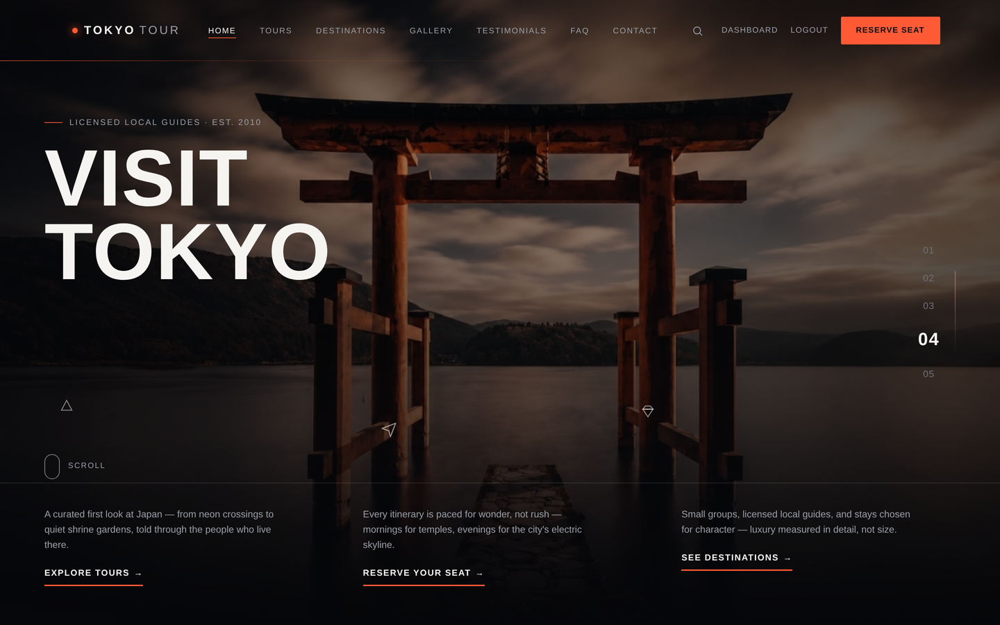
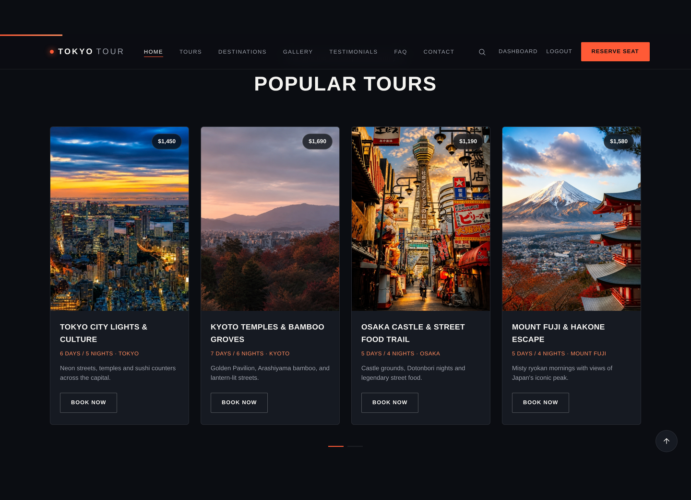
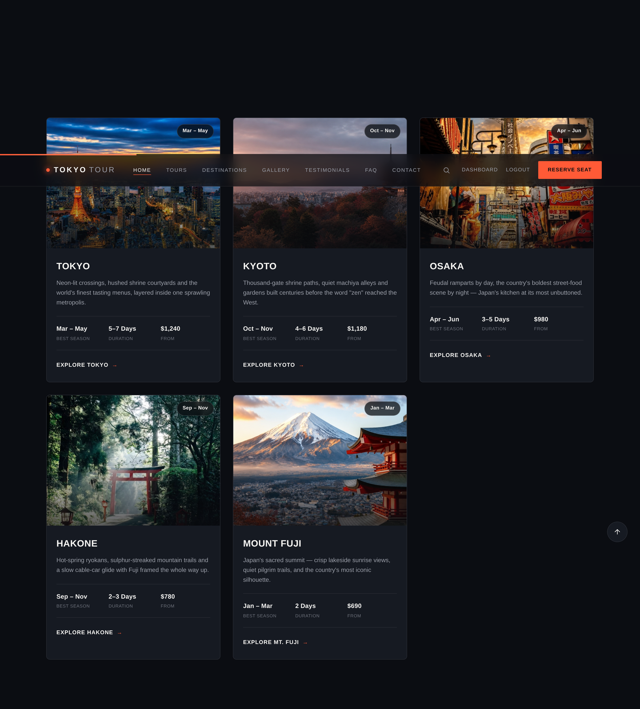
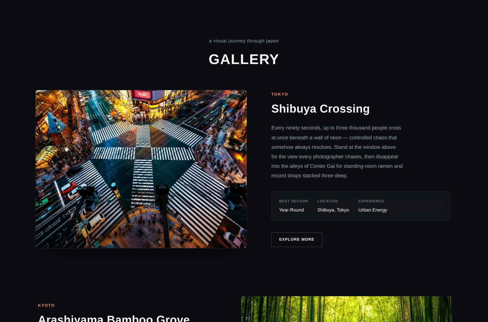
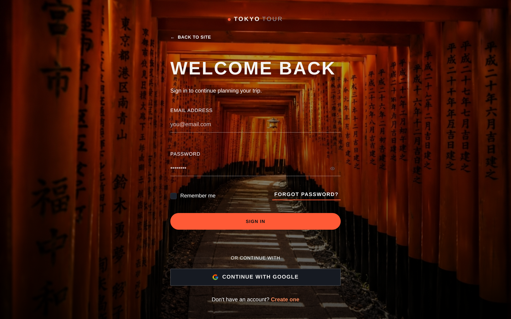
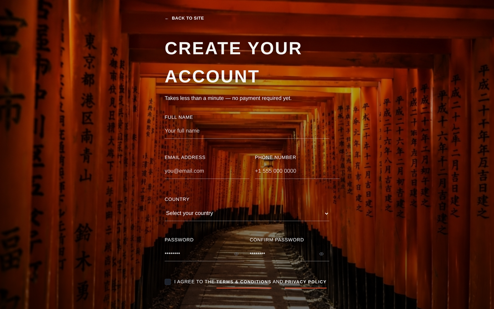
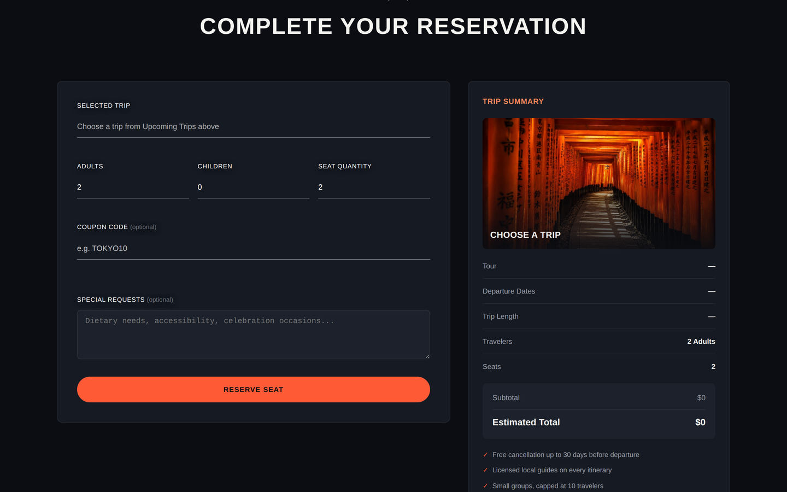
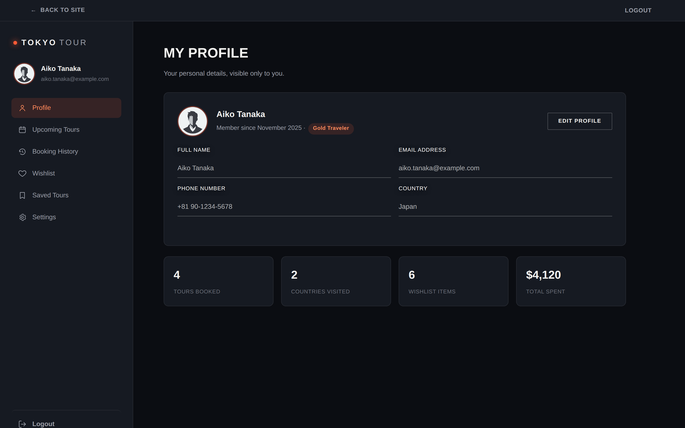
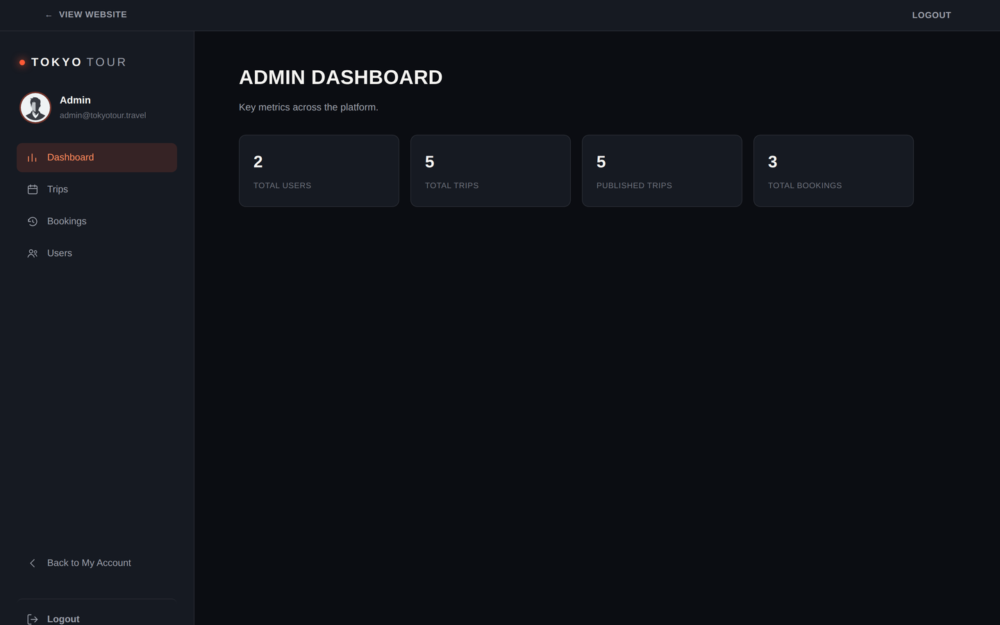
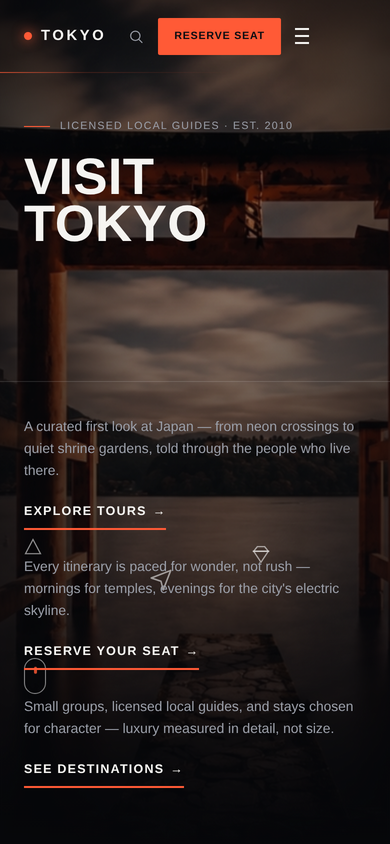

<div align="center">

# 🗼 Tokyo Tour

### Premium Full-Stack Travel Booking Platform

Discover and reserve guided tours across Tokyo, Kyoto, Osaka, Mount Fuji and Hakone — with real authentication, live seat availability, and a complete admin back-office.

[](https://developer.mozilla.org/en-US/docs/Web/HTML)
[](https://developer.mozilla.org/en-US/docs/Web/CSS)
[](https://developer.mozilla.org/en-US/docs/Web/JavaScript)
[](https://supabase.com/)
[](https://vercel.com/)
[](https://github.com/RoyalAmitYT)
[](LICENSE)
[](#)

**[🌐 Live Demo](https://tokyo-tour-blush.vercel.app/)**

</div>

<br>

<p align="center">
  
</p>

<br>

## Table of Contents

- [Project Overview](#project-overview)
- [Features](#features)
- [Technology Stack](#technology-stack)
- [Project Architecture](#project-architecture)
- [Folder Structure](#folder-structure)
- [Screenshots](#screenshots)
- [Installation Guide](#installation-guide)
- [Local Development](#local-development)
- [Supabase Configuration](#supabase-configuration)
- [Google OAuth Configuration](#google-oauth-configuration)
- [Deployment (Vercel)](#deployment-vercel)
- [Security Features](#security-features)
- [Responsive Design](#responsive-design)
- [Admin Panel](#admin-panel)
- [User Dashboard](#user-dashboard)
- [Booking System](#booking-system)
- [Future Improvements](#future-improvements)
- [License](#license)
- [Author](#author)

<br>

## Project Overview

**Tokyo Tour** is a full-stack travel booking platform for a premium guided-tour operator running scheduled departures across Japan. It combines a conversion-focused marketing site with a real reservation system: visitors browse scheduled trips with live seat availability, create an account, and reserve a seat with adults/children counts, an optional coupon code, and special requests. Every booking, trip, and user is backed by a real Postgres database via Supabase, protected end-to-end by Row Level Security — not mock data or `localStorage`.

The platform ships with two authenticated surfaces on top of the public site: a **User Dashboard** for managing bookings and travel preferences, and a role-gated **Admin Panel** for operating the business — managing trip inventory, reviewing incoming reservations, and administering user access.

The entire frontend is hand-built with semantic HTML5, modern CSS3, and dependency-free vanilla JavaScript — no frontend framework, no build step, no bundler. What you see in the repository is exactly what ships to production.

<br>

## Features

<table>
<tr>
<td valign="top" width="50%">

### 🔐 Authentication
- Email & password sign-up / sign-in
- Google Sign-In (OAuth via Supabase)
- Real, persisted sessions with automatic token refresh
- Forgot-password flow with email reset links
- Auth-aware route guards on every protected page
- Post-login redirect back to the page the user came from (e.g. mid-booking)

### 👤 User Features
- Personal **Dashboard** with profile & travel stats
- Editable profile (name, phone, country, avatar)
- **Upcoming Trips** and full **Booking History**
- **Wishlist** of destinations to revisit
- **Saved Tours** for later booking
- Account settings, including password changes

</td>
<td valign="top" width="50%">

### 🛠️ Admin Features
- Role-gated **Admin Dashboard** with live platform metrics
- Full **Trip Management** — create, edit, publish/unpublish, delete
- **Booking Management** — review reservations and update status
- **User Management** — search users and promote/revoke admin access

### ⚙️ Technical Features
- Supabase-backed Postgres database (Auth, tables, RPC functions)
- **Row Level Security (RLS)** enforced on every table
- Fully responsive layout, mobile-first breakpoints
- Custom-built, dependency-free UI (no CSS/JS framework)
- Scroll-reveal animations, testimonial carousel, FAQ accordion
- Deployed as a static site on Vercel

</td>
</tr>
</table>

<br>

## Technology Stack

| Layer | Technology |
|---|---|
| **Markup & Styling** | HTML5, CSS3 (custom properties, Grid & Flexbox, no preprocessor) |
| **Client Logic** | Vanilla JavaScript (ES6+), no framework, no bundler |
| **Backend-as-a-Service** | [Supabase](https://supabase.com/) — Postgres database, Authentication, Row Level Security, RPC functions |
| **Authentication Providers** | Email/Password, Google OAuth (via Supabase Auth) |
| **Hosting / Deployment** | [Vercel](https://vercel.com/) (static hosting, zero build config) |
| **Fonts** | Google Fonts — Oswald & Inter |
| **Version Control** | Git & GitHub |

There is intentionally no `package.json`, framework, or build pipeline. Every page is a plain `.html` file that loads the Supabase JS CDN client, followed by the project's own modular `.js` files.

<br>

## Project Architecture

Tokyo Tour follows a **layered, script-based architecture** rather than a component framework. Each concern lives in its own file, and every page loads only the layers it needs, in a strict order:

```
Supabase CDN client  →  session.js  →  data-service.js  →  page script (script.js / dashboard.js / admin.js)
```

| Layer | File | Responsibility |
|---|---|---|
| **Session Layer** | `session.js` | Single source of truth for authentication. Wraps Supabase Auth, exposes `TokyoTourSession` globally, and centralizes login, signup, Google OAuth, password reset, session persistence, and route guarding (`requireAuth`, `requireAdmin`). |
| **Data Layer** | `data-service.js` | Public data access — trips, bookings, and wishlist/saved-tours — exposed as `TokyoTourData`. All methods return Promises so the UI layer never touches Supabase directly. |
| **Admin Data Layer** | `admin-service.js` | Privileged data access for the Admin Panel — trip CRUD, booking status updates, platform statistics, and user role management via Postgres RPC functions — exposed as `TokyoTourAdmin`. |
| **Presentation Layer** | `script.js`, `dashboard.js`, `admin.js`, `auth.js` | Page-specific rendering, form validation, and UI interaction, one file per page/surface. |

This separation means the same `data-service.js` file backs the homepage's trip listings, the booking flow, and the dashboard's booking history — there is a single implementation of "what a trip looks like" across the entire app. Every protected page (Dashboard, Admin Panel) performs its own `requireAuth()` / `requireAdmin()` check on load, in addition to Postgres RLS enforcing the same rules server-side — a defense-in-depth approach where no single layer is trusted alone.

<br>

## Folder Structure

```
tokyo-tour/
├── index.html              # Marketing homepage (hero, tours, destinations, gallery, testimonials, FAQ)
├── login.html               # Sign-in page (email/password + Google)
├── register.html             # Account creation page
├── booking.html              # Trip listing + reservation form
├── dashboard.html             # User dashboard (profile, bookings, wishlist, saved tours, settings)
├── admin.html                # Admin panel (stats, trips, bookings, users)
│
├── session.js                # Authentication & session management (TokyoTourSession)
├── data-service.js            # Public data layer — trips, bookings, wishlist (TokyoTourData)
├── admin-service.js            # Admin data layer — trip/booking/user management (TokyoTourAdmin)
├── auth.js                   # Login/Register form logic & validation
├── script.js                  # Homepage & booking page interactions
├── dashboard.js                # Dashboard tab logic & rendering
├── admin.js                   # Admin panel tab logic & rendering
│
├── style.css                  # Complete design system (single stylesheet)
├── images/                    # Destination photography used across the site
│
├── README-assets/               # Screenshots referenced in this README
├── LICENSE
└── README.md
```

<br>

## Screenshots

<details open>
<summary><strong>🏠 Homepage</strong></summary>
<br>

**Hero Section**


**Scheduled Trips**


**Destinations**


**Gallery**


</details>

<details>
<summary><strong>🔐 Authentication</strong></summary>
<br>

**Login**


**Register**


</details>

<details>
<summary><strong>🎫 Booking Flow</strong></summary>
<br>



</details>

<details>
<summary><strong>👤 User Dashboard</strong></summary>
<br>



</details>

<details>
<summary><strong>🛠️ Admin Panel</strong></summary>
<br>



</details>

<details>
<summary><strong>📱 Mobile Responsive View</strong></summary>
<br>



</details>

<br>

## Installation Guide

Tokyo Tour has no build step — it's a static HTML/CSS/JS site backed by Supabase.

**1. Clone the repository**
```bash
git clone https://github.com/RoyalAmitYT/tokyo-tour.git
cd tokyo-tour
```

**2. Configure Supabase**

Follow [Supabase Configuration](#supabase-configuration) below to provision a project, create the schema, and connect it to the app.

**3. Serve the project locally**

See [Local Development](#local-development).

<br>

## Local Development

Because the app uses ES modules-free, CDN-loaded Supabase client scripts, it must be served over HTTP (not opened directly as a `file://` URL, so relative fetches and Supabase's redirect handling behave correctly).

Any static file server works. For example:

```bash
# Using Python
python3 -m http.server 5500

# Using Node (http-server)
npx http-server -p 5500

# Using the VS Code "Live Server" extension
# Right-click index.html → "Open with Live Server"
```

Then open **`http://localhost:5500`** in your browser.

> The Supabase project URL and public (`anon`) key are configured directly inside `session.js` and `data-service.js`. There is no `.env` file to manage for local development — see the section below to point these at your own Supabase project.

<br>

## Supabase Configuration

Tokyo Tour uses Supabase for authentication, database, and authorization.

<details>
<summary><strong>Expand for full setup steps</strong></summary>
<br>

**1. Create a Supabase project** at [supabase.com](https://supabase.com/).

**2. Create the schema.** At minimum, the app expects:

- **`profiles`** — one row per user (`id` references `auth.users.id`), storing `full_name`, `phone`, `country`, `avatar_url`, `created_at`. Populated automatically on sign-up via a database trigger on `auth.users`.
- **`trips`** — `id`, `destination`, `title`, `description`, `start_date`, `end_date`, `duration_days`, `price`, `total_seats`, `seats_available`, `image_url`, `featured`, `published`.
- **`bookings`** — `id`, `user_id`, `trip_id`, `booking_status` (`pending` / `confirmed` / `cancelled` / `completed`), `payment_status` (`unpaid` / `paid` / `refunded` / `failed`), `adults`, `children`, `coupon_code`, `special_requests`, `subtotal`, `discount`, `total_price`, timestamps.

**3. Enable Row Level Security** on `profiles` and `bookings`, restricting reads/writes to `user_id = auth.uid()`. Admin-only mutations (trip management, booking status updates, user role changes) should be routed through Postgres functions (`admin_list_users`, `admin_set_user_role`, etc.) callable only by users whose JWT carries `app_metadata.role = 'admin'`.

**4. Grant admin access** by setting `app_metadata.role = 'admin'` on a user via the Supabase Dashboard or Admin API — never through client-editable `user_metadata`, which keeps admin status impossible to self-grant.

**5. Connect the app to your project.** Update the `SUPABASE_URL` and `SUPABASE_ANON_KEY` constants at the top of:
   - `session.js`
   - `data-service.js`
   - `admin-service.js`

The `anon` key is a public, publishable key by design (it's safe to ship to the browser) — all real access control is enforced server-side by RLS and the admin RPC functions above, not by keeping this key secret.

</details>

<br>

## Google OAuth Configuration

Google Sign-In is handled entirely through **Supabase Auth's built-in OAuth provider** — the app itself never talks to Google directly.

1. In the [Google Cloud Console](https://console.cloud.google.com/), create OAuth 2.0 credentials (Web application type).
2. Add your Supabase project's callback URL as an authorized redirect URI:
   ```
   https://<your-project-ref>.supabase.co/auth/v1/callback
   ```
3. In the Supabase Dashboard, go to **Authentication → Providers → Google**, enable it, and paste in the Client ID and Client Secret from step 1.
4. Add your site's URL(s) (local and production) to **Authentication → URL Configuration → Redirect URLs**.

Once enabled, the "Continue with Google" buttons on `login.html` and `register.html` work without any further code changes — `session.js` already calls `supabase.auth.signInWithOAuth({ provider: 'google' })` under the hood.

<br>

## Deployment (Vercel)

The site is deployed on **Vercel** as a static project — there is no framework preset or build command required.

1. Push the repository to GitHub.
2. In [Vercel](https://vercel.com/), click **Add New Project** and import the repository.
3. Set the **Framework Preset** to `Other` and leave the **Build Command** empty — Vercel will serve the static files as-is.
4. Add your production domain(s) to Supabase's **Authentication → URL Configuration → Redirect URLs** (needed for the Google OAuth callback and password-reset emails to redirect correctly).
5. Deploy.

The live production build is available at:
**[https://tokyo-tour-blush.vercel.app/](https://tokyo-tour-blush.vercel.app/)**

<br>

## Security Features

- **Row Level Security (RLS)** on every user-facing table — a `bookings` row is only ever readable or writable by `user_id = auth.uid()`, enforced by Postgres itself, not by client-side logic.
- **Server-derived admin role.** Admin status is read from `app_metadata.role` on the signed-in JWT — a claim only ever set server-side — so it can never be spoofed or self-granted from the browser, unlike a flag stored in an editable profile record.
- **Privileged mutations via RPC.** Trip and booking management run through dedicated Postgres functions rather than direct table writes, keeping authorization logic in the database rather than duplicated across client code.
- **Defense-in-depth route guards.** Every protected page checks authentication/admin status on load *and* relies on RLS as the ultimate enforcement layer — a UI bug in one guard can't expose data the database wouldn't return anyway.
- **Live re-validation at booking time.** Seat availability and trip publication status are re-checked against the database immediately before a booking is inserted, preventing stale-client race conditions (e.g. two users booking the last seat simultaneously).
- **Non-enumerable password resets.** The "forgot password" flow always shows the same neutral confirmation message, whether or not the submitted email has an account, preventing account enumeration.
- **Friendly error surfacing.** Raw Supabase/Postgres error messages are logged to the console for debugging but never shown to end users, who instead see short, non-technical copy.

<br>

## Responsive Design

Every page — the marketing site, authentication forms, booking flow, dashboard, and admin panel — is built mobile-first with fluid typography (`clamp()`), CSS Grid/Flexbox layouts, and dedicated breakpoints for tablet and mobile viewports. Navigation collapses into a mobile menu, multi-column layouts stack vertically, and touch targets are sized appropriately for handheld use.

<p align="center">
  
</p>

<br>

## Admin Panel

A role-gated back-office (`admin.html`) available only to accounts with `app_metadata.role = 'admin'` — any other signed-in user is silently redirected to their own Dashboard, and guests are sent to Login.

- **Dashboard** — at-a-glance platform metrics: total users, total trips, published trips, and total bookings.
- **Trips** — create, edit, publish/unpublish, and delete tour departures.
- **Bookings** — review every reservation across all users and update its status.
- **Users** — search the user base and promote or revoke admin access.

<p align="center">
  
</p>

<br>

## User Dashboard

A personal account area (`dashboard.html`) for signed-in travelers, organized into tabs:

- **Profile** — personal details and at-a-glance stats (tours booked, countries visited, wishlist items, total spent).
- **Upcoming Trips** — reservations for departures that haven't happened yet.
- **Booking History** — a complete record of past bookings.
- **Wishlist** — destinations saved for future consideration.
- **Saved Tours** — specific tour packages bookmarked for later.
- **Settings** — account and password management.

<p align="center">
  
</p>

<br>

## Booking System

The reservation flow (`booking.html`) lists scheduled departures grouped by month, pulled live from the `trips` table, and only shows trips that are published and have not yet started.

Selecting a trip populates a live-updating **Trip Summary** panel while the traveler fills in:
- Adults & children counts, and total seat quantity
- An optional coupon code
- Optional special requests (dietary needs, accessibility, celebrations)

On submission, the app re-validates the trip's live seat availability and publication status against the database — not the possibly-stale list the visitor loaded the page with — before inserting the booking, preventing overbooking when multiple users compete for the last seats. A confirmation modal then displays a human-readable booking reference derived from the reservation's database ID.

<br>

## Future Improvements

- Online payment processing (Stripe/PayPal) — bookings currently track `payment_status` but do not yet process live payments
- A dedicated `wishlist_items` database table to replace the current per-user `localStorage` persistence for Wishlist and Saved Tours
- Email notifications for booking confirmations and status changes
- Multi-language support for an international audience
- Automated end-to-end test coverage for the booking and authentication flows

<br>

## License

This project is licensed under the **MIT License** — see the [LICENSE](LICENSE) file for details.

<br>

## Author

**RoyalAmitYT**

- GitHub: [@RoyalAmitYT](https://github.com/RoyalAmitYT)

<br>

<div align="center">

If you found this project useful, consider giving it a ⭐ on GitHub.

</div>
